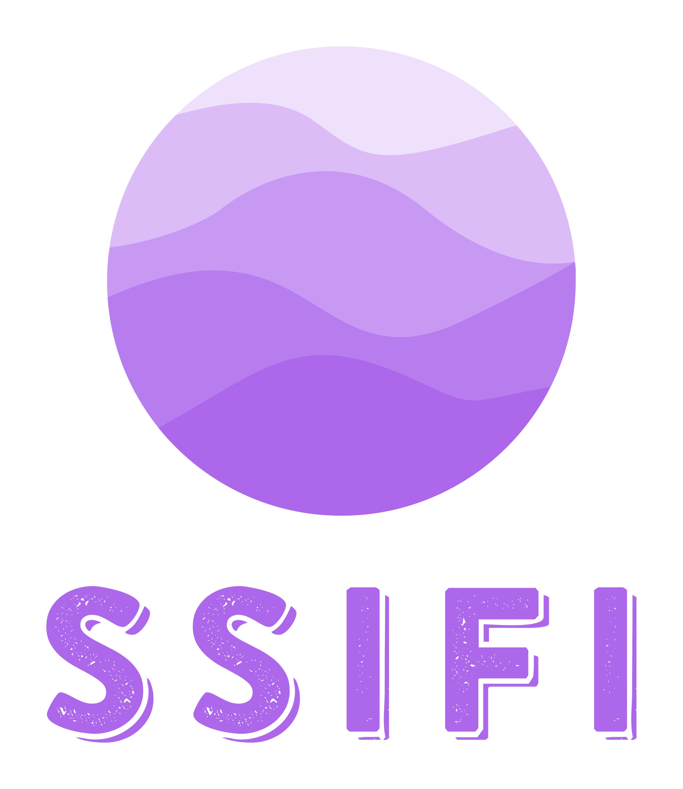

# SSIFI

     


## Index

- [SSIFI](#ssifi)
  - [Intro](#intro)
  - [Service Example](#service)
  - [Installation](#install-dependencies)
  - [How To Use](#how-to-use)
- [STT](<#sttspeech-to-text-speech-recognitionkorean>)
  - [Transcription](#transcription)
- [NLP](<#nlpnatural-language-processing>)
  - [Save Model](#save-model)
  - [Fine-Tuning](#fine-tuning)
  - [Usage](#usage)
- [TTS](<#ttstext-to-speech-fastspeech-2-korean>)
  - [Preprocessing](#preprocessing)
  - [Training](#training)
  - [Pre-trained Model](#pre-trained-model)
  - [Synthesis](#synthesis)
  - [Tensorboard](#tensorboard)
- [License](#license)
- [References](#references)


## Intro

> 이 프로젝트의 목표는 대화형 AI 대한 접근성을 높이는 것 입니다. 이 오픈소스를 통해서 사용자는 STT, NLP, TTS 기술을 보다 쉽게 사용하실 수 있습니다.


## Service

(프로젝트 서비스 이미지)

- 해당 서비스는 오픈소스를 바탕으로 제작한 학습용 예시 서비스 입니다.


## Install Dependencies

먼저 Python = 3.7, [PyTorch](https://pytorch.org/), [ffmpeg](https://ffmpeg.org/)와 [g2pk](https://github.com/Kyubyong/g2pK) 순으로 설치를 진행합니다.

해당 설치 과정은 TTS에서 사용되는 패키지의 의존성 문제 때문에 선행으로 진행하게 됩니다.

아래에 설치 커맨드를 순서대로 진행하셔서 패키지를 설치하시면 됩니다.

```
# ffmpeg install
pip install ffmpeg

# [WARNING] g2pk를 설치하시기 전에 g2pk github을 참조하셔서 g2pk의 dependency를 설치하시고 g2pk를 설치하시거나, 혹은 아래의 순서대로 패키지 설치를 진행하시기 바랍니다. 
1. pip install wget
2. pip install -v python-mecab-ko
3. pip install jamo
4. pip install konlpy
5. pip install nltk
6. pip install g2pk
```

다음으로, 필요한 모듈을 pip를 이용하여 설치합니다.

```
pip install -r requirements.txt
```

**[WARNING]**

**1. Window에서는 g2pk의 dependency인 python-mecab-ko 설치문제가 발생하며, Window 버전을 설치 하더라도 g2pk 설치시 에러가 발생할 수 있기 때문에 linux 환경을 권장드립니다.**

**2. Anaconda 가상환경을 사용하시는 것을 권장드립니다.**


## How to use

```
python ssifi.py
```

해당 커맨드는 STT - NLP - TTS 순으로 동작합니다.

먼저 ssifi.py는 STT의 샘플음성 데이터를 기본으로 실행 및 결과값을 받을 수 있도록 되어 있습니다.

NLP, TTS의 경우 모듈 및 경로가 기본값으로 설정이 되어있습니다.

 STT, NLP, TTS를 사용하기 위한 변수값을 지정하고, 해당파트를 참고하여 사전학습된 모델이 경로에 위치해 있는지 확인이 진행된 후 커맨드를 실행해 주세요.


# STT(Speech To Text) - Speech Recognition(Korean)

> 본 프로젝트에서는 STT로 [Speech Recognition](https://github.com/Uberi/speech_recognition) 라이브러리를 사용했습니다. 해당 라이브러리는 온라인 및 오프라인에서 여러 엔진 및 API를 지원하여 음성 인식을 수행하기 위한 라이브러리 입니다. 라이브러리에는 다양한 기능이 있지만, 현재 프로젝트에서는 한국어 음성이 녹음된 파일을 이용하기 때문에 한국어 음성을 텍스트화 하는 기능만 사용합니다.

- Speech recognition가 지원하는 engine/API:
  - [CMU Sphinx](http://cmusphinx.sourceforge.net/wiki/) (works offline)
  - Google Speech Recognition(프로젝트에서 사용한 모델)
  - [Google Cloud Speech API](https://cloud.google.com/speech/)
  - [Wit.ai](https://wit.ai/)
  - [Microsoft Azure Speech](https://azure.microsoft.com/en-us/services/cognitive-services/speech/)
  - [Microsoft Bing Voice Recognition (Deprecated)](https://www.microsoft.com/cognitive-services/en-us/speech-api)
  - [Houndify API](https://houndify.com/)
  - [IBM Speech to Text](http://www.ibm.com/smarterplanet/us/en/ibmwatson/developercloud/speech-to-text.html)
  - [Snowboy Hotword Detection](https://snowboy.kitt.ai/) (works offline)
  - [Tensorflow](https://www.tensorflow.org/)
  - [Vosk API](https://github.com/alphacep/vosk-api/) (works offline)


## Transcription

```python
# STT
audio_path = './STT/audio_sample/korean.wav'
prompt = STT.speech_recognition(audio_path)
```

- ssifi.py
  - audio_path: 텍스트화 하고자 하는 음성파일의 경로
  - prompt: 텍스트화 결과값(NLP의 input)


# NLP(Natural Language Processing)

> 본 프로젝트에서는 3가지 NLP 모델을 이용해 자연어 이해 및 확장을 구현합니다.
>
> 사용하는 NLP 모델과 그 활용은 다음과 같습니다.
>
> 1. SKT-KoGPT : Chatbot, Wellnessbot, Novelbot
> 2. KAKAO-kogpt : Chatbot
> 3. GLIDE-text2im : Painterbot


## Save Model

- SSIFI 에서 제공하는 기본모델 : `BASICBOT, NOVELBOT, WELLNESSBOT, PAINTERBOT, KAKAO-KOGPT `

  - BASICBOT 
    - Fine-Tuning 하지 않은 KoGPT2(SKT-KoGPT) Pretrained Model
  - NOVELBOT
    - 소설 데이터를 바탕으로 Fine-Tuning이 진행된 KoGPT2(SKT-KoGPT) Model
  - WELLNESSBOT
    - 심리상담 데이터를 바탕으로 Fine-Tuning이 진행된 KoGPT2(SKT-KoGPT) Model
  - PAINTBOT
    - Fine-Tuning 하지 않은 GLIDE-text2im Pretrained Model(Input 값으로 한국어 텍스트 사용불가)
  - KAKAO-KOGPT6B-ryan1.5b-float16 
    - KAKAO에서 제작되었으며 Fine-Tuning 하지 않은 Pretrained Model
    - half-precision(반정밀도)는 Volta, Turing 또는 Ampere 기반의 NVIDIA GPU가 필요합니다.
    - 최소 16GB 이상 GPU 메모리가 필요합니다. 

- 다음 명령어를 통해 제공 모델을 다운받을 수 있습니다. (모델 저장 위치 : `NLP/models`)

  ```
  python NLP/save_models.py
  ```


## Fine-Tuning

- NLP 모델의 Fine-tuning 은 Colab 활용을 위해 Jupyter-notebook 으로 작성되었습니다.
- PC에서 작업 하셔도 Jupyter-notebook 사용이 가능합니다.
- `ssifi/NLP/notebook` 폴더의 파일을 참고하세요.


## Usage

```python
# NLP (BASICBOT)
output = Basicbot.basicbot(prompt, length)
print(output)
```

- ssifi.py
  - prompt: NLP의 Input Text (STT 결과 값)
  - length: output Text의 최대 길이
  - ouput: NLP 결과값


# TTS(Text To Speech) - FastSpeech 2 Korean

> 이 프로젝트의 TTS는 Microsoft의 [**FastSpeech 2(Y. Ren et. al., 2020)**](https://arxiv.org/abs/2006.04558)를 [**Korean Single Speech dataset (이하 KSS dataset)**](https://www.kaggle.com/bryanpark/korean-single-speaker-speech-dataset)에서 동작하도록 구현한 것입니다.
>
> 본 소스코드는 https://github.com/HGU-DLLAB/Korean-FastSpeech2-Pytorch 를 변형 및 수정한 것입니다.
>
> 변경 사항
>
> - preprocess.py, train.py, synthesize.py의 실행 부분을 함수화
> - 모듈 사용을 위한 경로 관련 코드 추가 및 수정
> - ssifi.py를 통해 음성 생성하기 위해 필요한 변수 추가
>   - 생성된 음성파일 저장경로(results_path)
>   - 파일명(file_name)
>   - 트레이닝 된 모델의 step(step)


## Preprocessing

**(1) kss dataset download**

- [Korean-Single-Speech dataset](https://www.kaggle.com/bryanpark/korean-single-speaker-speech-dataset): 12,853개(약 12시간)의 샘플로 구성된 한국어 여성 단일화자 발화 dataset입니다.

dataset을 다운로드 하신 후, 압축을 해제하시고 `hparams.py`에 있는 `data_path`에 다운받은 kss dataset의 경로를 기록해주세요.

**(2) phoneme-utterance sequence간 alignment 정보 download**

- KSS ([download](https://drive.google.com/file/d/1LgZPfWAvPcdOpGBSncvMgv54rGIf1y-H/view?usp=sharing))

FastSpeech2를 학습하기 위해서는 [Montreal Forced Aligner](https://montreal-forced-aligner.readthedocs.io/en/latest/)(MFA)에서 추출된 utterances와 phoneme sequence간의 alignment가 필요합니다. kss dataset에 대한 alignment 정보(TextGrid)는 위의 링크에서 다운로드 가능합니다. 다운 받은 `TextGrid.zip`파일을 `프로젝트 폴더 (TTS)`에 두시면 됩니다.

**\*KSS dataset에 적용된 [License](https://creativecommons.org/licenses/by-nc-sa/4.0/)로 인해 kss dataset에서 추출된 TextGrid를 상업적으로 사용하는 것을 금합니다.**

**(3) 데이터 전처리**

1. hparms.py

- dataset : dataset의 폴더 이름
- data_path : dataset의 상위 폴더 경로
- meta_name : metadata의 text 파일명 ex)transcript.v.1.4.txt
- tetxgrid_name : textgrid 압축 파일의 파일명

2. preprocess.py

- line 42:` if "kss" in hp.dataset:` 에서 kss 부분은 본인이 설정한 dataset 이름을 작성하시면 됩니다.

```
python TTS_preprocess.py
```

data 전처리를 위해 위의 커맨드를 입력해 주세요. 전처리 된 데이터는 프로젝트 폴더의 `TTS/preprocessed/hp.dataset` 에 생성됩니다.


## Training

모델 학습 전에, kss dataset에 대해 사전학습된 [VocGAN](https://github.com/rishikksh20/VocGAN)(neural vocoder)을 [다운로드](https://drive.google.com/file/d/1GxaLlTrEhq0aXFvd_X1f4b-ev7-FH8RB/view?usp=sharing) 하여 `vocoder/pretrained_models/` 경로에 위치시킵니다. 만약, VocGAN에 대한 학습이 필요하시다면 References의 VocGAN을 참고하셔서 진행하시면 됩니다.
아래의 커맨드를 입력하여 모델의 학습을 수행합니다.

```
python TTS_train.py
```

학습된 모델은 `ckpt/`에 저장되고 tensorboard log는 `log/`에 저장됩니다. 학습시 evaluate 과정에서 생성된 음성은 `eval/` 폴더에 저장됩니다.

만약, 학습된 모델에 이어서 진행 하시려면 TTS_train.py의 `start_train`함수에 변수 값으로 학습된 모델의 step 값을 넣어주시면 됩니다.


## Pre-trained Model

pretrained model(checkpoint)을 [다운로드](https://drive.google.com/file/d/1qkFuNLqPIm-A5mZZDPGK1mnp0_Lh00PN/view?usp=sharing)해 주세요.
그 후, `hparams.py`에 있는 `checkpoint_path` 변수에 기록된 경로에 위치시켜주시면 사전학습된 모델을 사용 하실 수 있습니다.


## Synthesis

사전에 학습이 진행된 것이 없으시다면 [Pre-trained Model](#pre-trained-model)과 [Training](#training) 을 참고하여 학습된 모델을 다운 받고 해당 경로에 위치 시킨 후 진행 하시길 바랍니다.

학습된 파라미터를 기반으로 음성을 생성하기 위해서는 ssifi.py에서 make_sound함수를 통해 생성하실 수 있습니다.

`make_sound(file_name, sentence, results_path, step=350000)`

- file_name: 생성되는 음성 파일의 이름

- sentence: input text

- result_path: 합성된 음성 파일이 저장되는 경로
- step: 학습이 진행된 모델의 step(default=350000)

상세코드는 `TTS/synthesize.py` 를 참고하시면 됩니다.


## Fine-Tuning

 전처리 및 학습을 위한 데이터 구조는 kss 데이터 구조에 맞춰져 있습니다. 현재 프로젝트에서 Fine-tuning을 진행하기 위해서는 데이터 구조 및 경로에 대한 parameter 설정 후 training과 같은 방법으로 진행 하시면 됩니다. 


## Tensorboard

```
tensorboard --logdir log/hp.dataset/
```

- hp.dataset: hparams.py에 등록된 dataset 변수에 등록된 경로
  tensorboard log들은 `log/hp.dataset/` directory에 저장됩니다. 그러므로 위의 커멘드를 이용하여 tensorboard를 실행해 학습 상황을 모니터링 하실 수 있습니다.


# License

- STT
  - Speech Recognition 라이브러리는 [BSD](./STT/LICENSE) 라이선스 하에 공개되어 있습니다.

- NLP
  - SKT-KoGPT는 [CC-BY-NC-ND 4.0 ](./NLP/LICENSE/) 라이선스 하에 공개되어 있습니다.
  - KakaoBrain KoGPT의 소스코드(source code)는 [Apache 2.0](./NLP/LICENSE.apache-2.0) 라이선스 하에 공개되어 있습니다.
  - KakaoBrain KoGPT의 사전학습된 가중치(pretrained weights)는 [CC-BY-NC-ND 4.0](https://creativecommons.org/licenses/by-nc-nd/4.0/) 라이선스 하에 공개되어 있습니다.
  - GLIDE-text2im는 [MIT](./NLP/LICENSE.MIT) 라이선스 하에 공개되어 있습니다.
- TTS
  - 활용한 [오픈소스](https://github.com/HGU-DLLAB/Korean-FastSpeech2-Pytorch)에서 사용된 Fastspeech2 모델은 [MIT](./TTS/LICENSE) 라이선스 하에 공개되어 있습니다.

모델 및 코드, 사전학습된 가중치를 사용할 경우 라이선스 내용을 준수해 주세요.


# References

- STT
  - [GitHub - speech_recognition](https://github.com/Uberi/speech_recognition)
- NLP
  - KoGPT2
    - [GitHub - SKT-AI/KoGPT2: Korean GPT-2 pretrained cased (KoGPT2)](https://github.com/SKT-AI/KoGPT2)
    - [GitHub - ttop32/KoGPT2novel](https://github.com/ttop32/KoGPT2novel)
    - [GitHub - nawnoes/WellnessConversation-LanguageModel](https://github.com/nawnoes/WellnessConversation-LanguageModel)
  - KAKAO - kogpt
    - [GitHub - kakaobrain/kogpt](https://github.com/kakaobrain/kogpt)
  - GLIDE - text2im
    - [GitHub - openai/glide-text2im](https://github.com/openai/glide-text2im)
    - [Kaggle - GLIDE multiple-image tuning](https://www.kaggle.com/code/neverix/glide-multiple-image-tuning/notebook)
- TTS
  - [FastSpeech 2: Fast and High-Quality End-to-End Text to Speech](https://arxiv.org/abs/2006.04558), Y. Ren, _et al_.
  - [FastSpeech: Fast, Robust and Controllable Text to Speech](https://arxiv.org/abs/1905.09263), Y. Ren, _et al_.
  - [ming024's FastSpeech2 impelmentation](https://github.com/ming024/FastSpeech2)
  - [rishikksh20's VocGAN implementation](https://github.com/rishikksh20/VocGAN)
  - [HGU-DLLAB](https://github.com/HGU-DLLAB/Korean-FastSpeech2-Pytorch)
